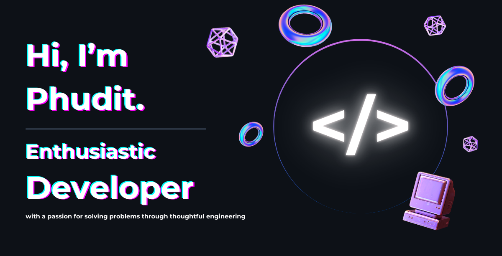

  

Hi, I'm Phudit — a passionate developer with a strong interest in software engineering and data engineering. I'm constantly exploring new technologies and best practices to improve my skills and stay up to date in the field. I'm always open to learning and growing, so if you have any advice, insights, or resources to share, I'd love to hear from you!

### ⚡ Recent Activity

**Currently working on:**

**Activities:**

<!--RECENT_ACTIVITY:start-->
1. ⬆️ Pushed undefined commit(s) to [6SL3PT/homelab](https://github.com/6SL3PT/homelab) 
2. ⬆️ Pushed undefined commit(s) to [6SL3PT/homelab](https://github.com/6SL3PT/homelab) 
3. ⬆️ Pushed undefined commit(s) to [6SL3PT/homelab](https://github.com/6SL3PT/homelab) 
4. ⬆️ Pushed undefined commit(s) to [6SL3PT/homelab](https://github.com/6SL3PT/homelab) 
5. ⬆️ Pushed undefined commit(s) to [6SL3PT/spotify-readme-widget](https://github.com/6SL3PT/spotify-readme-widget) 
<!--RECENT_ACTIVITY:end-->

<!--RECENT_ACTIVITY:last_update-->
Last Updated: Monday, November 10th, 2025, 1:39:10 AM
<!--RECENT_ACTIVITY:last_update_end-->

> Tip: powered by [GitHub Readme Activity Workflow](https://github.com/Readme-Workflows/recent-activity)

### 🎧 Spotify Now Playing

  

### 📊 Github Stats

<table align='center'>
  <td></td>
  <td></td>
</table>
